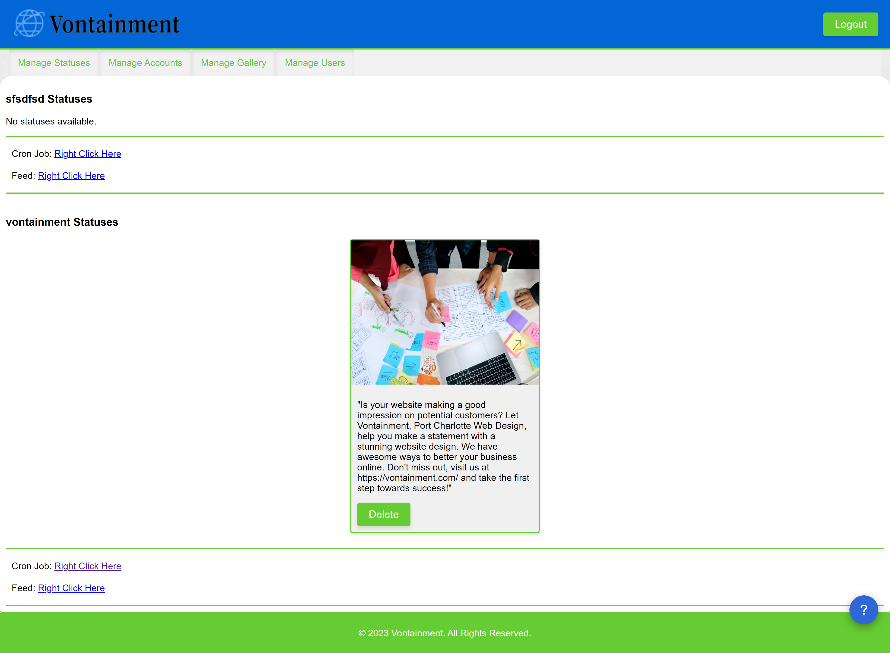

# ChatGPT Social Status2RSS
ChatGPT Social Status2RSS is a powerful script and Web GUI that takes social media management to the next level. With customizable prompts and automatic generation of engaging statuses, this tool allows you to effortlessly create captivating status updates for your clients. But it doesn't stop there! The generated statuses are seamlessly added to RSS feeds, making it a breeze to automate posting across various social media platforms.

## Exciting Updates!
We're thrilled to introduce some exciting new features and improvements:

Multi-user support: Collaborate with your team and assign different roles to manage users effectively.
Enhanced interface: Enjoy the convenience of a sleek and intuitive tabbed interface for streamlined navigation.
Robust Web Application Firewall (WAF): Your data and accounts are now even more secure with our advanced security measures.
Expanded options: Customize your statuses with links and hashtags, enhancing engagement and driving traffic.
Status images: Bring your statuses to life by attaching captivating images, grabbing attention and boosting engagement.
User limits and more: Set API call limits, maximum number of accounts per user, and maximum number of statuses to manage resources effectively. The new help button, set your own help service.

### How It Works
Admins vs Users
As an admin, you have full control to create and manage users within the system. Users, on the other hand, have the ability to create "accounts" that represent unique prompts, link collections, and image stashes.

#### Status Generation
Each account created in the system has its own cron job, which can be scheduled or triggered manually to generate statuses. The cron job links contain the account name and a secret key for secure access.

#### RSS Feeds
Every account automatically generates an RSS feed where the statuses are seamlessly incorporated. You can easily leverage this RSS feed by connecting it to automation tools like IFTTT, allowing for effortless posting across various social networks.

#### Image Stash
Each account serves as a "social account" with a dedicated image stash. Through the user-friendly GUI, you can upload images directly and have them randomly attached to the generated statuses. This adds visual appeal and diversity to your social media posts.

#### Limits
To ensure optimal performance and resource management, you can set limits on API calls, maximum accounts per user, and maximum statuses per account. For example, you can specify a limit of 30 statuses per account, with the system automatically removing the oldest status and its associated image when a new one is generated.

#### Get Started
Getting started is quick and easy! Simply edit the config.php file to configure your API key and other settings. For the default admin login credentials, please refer to the storage/users/admin file.

### Change Log

#### Version 3.0.0
- Cleaned up code, lowered API usage for same outcome.
- Added quick share status to Facebook, Twitter, Pinterest, and Linkedin.
 - Due to the nature of sharing by social links, Facebook and Linkedin auto copy the status to the clipboard and you will have to past in the status window.

#### Version 2.0.1
- Added
 - Added optimization on upload of images.
   - Maximum size for image width can now be set in the config file. Default size is 720p.
 - Created a support pop-up on the bottom right.
   - Integrated support ticket iFrame from CRM into the pop-up.
   - Customizable support pop-up settings in `/libs/support - lib.php`.

- Restructured
 - Restructured the code to minimize PHP usage and moved most PHP outside webroot.
 - Improved users, accounts, and images file storage structure.
   - Uploaded images are now stored outside of the web route.
   - Images are moved inside the webroot when assigned to a status.

- Enhanced Functionality
 - Added support for setting a maximum amount of API calls per user.
 - Implemented the ability to reset used API calls in the "Manage User" tab.
 - Added a "Change Password" tab for users to change their password.
   - The tab displays current API usage and the total number of allowed accounts.
 - Set a maximum amount of statuses per account in the feed via the config file.
   - When a status is created and exceeds the set amount, the oldest status along with its associated image is  deleted.
 - Improved display of the "Manage Status" tab, especially on desktop devices.

- Improved URLs
 - Updated the RSS and cron URLs to include the user name and account information.
   - This change simplifies logic handling with reduced PHP requirements.

### To-Do List
We're continuously working to enhance the ChatGPT Social Status2RSS experience. Here are some items on our to-do list:
-Polish the GUI to provide an even more delightful user experience.
-Explore the possibility of generating AI-powered images to further enrich your statuses.
-Continuously improve the code structure and security to ensure a robust and reliable platform.
-Join us on this exciting journey as we revolutionize social media management and empower you with cutting-edge tools to create captivating and engaging content effortlessly.

Get ready to take your social media game to new heights with ChatGPT Social Status2RSS!

### Installing
- Upload files to web server.
- Change docroot to public folder.
- Update config.php
- Login admin/admin